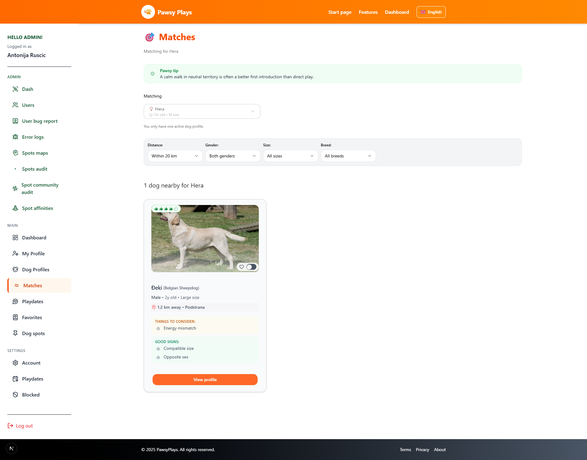
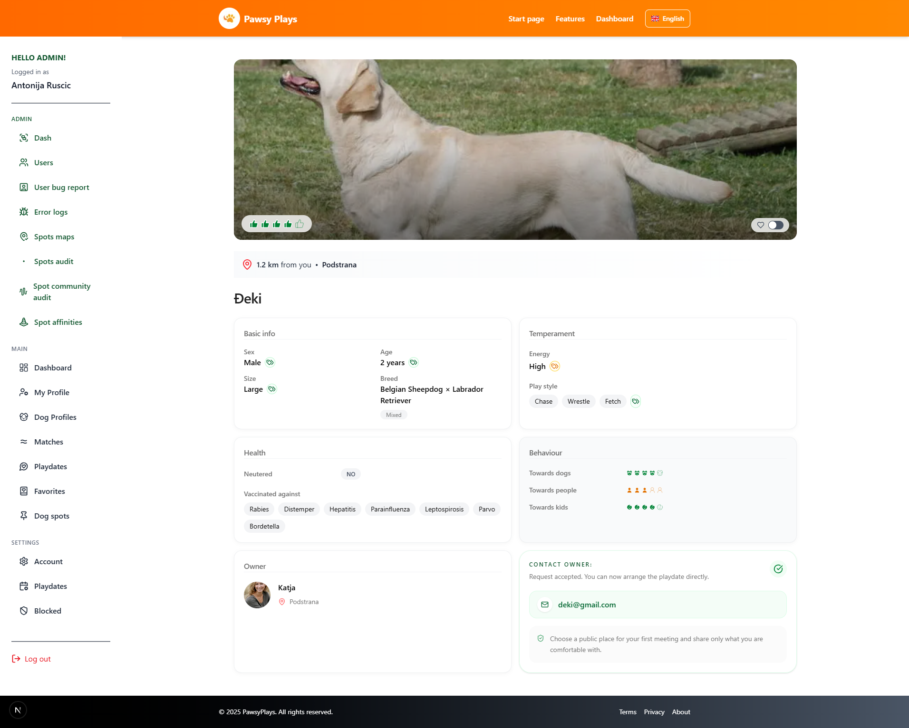

# Pawsy Matching Architecture Sample

Pawsy is a location-based dog matching and community platform, still in development.

This repository contains a simplified version of the matching engine used to generate compatibility recommendations.

## Features

- Geospatial candidate filtering
- Reciprocal visibility
- Multi-factor compatibility scoring
- Explainable match signals
- Match tiering

## Screenshots

### Matches page

### Match details

## Architecture

- docs/geospatial-filtering.md
- docs/matching-pipeline.md

## Key file

- src / matching /score_eligible_dogs.ts