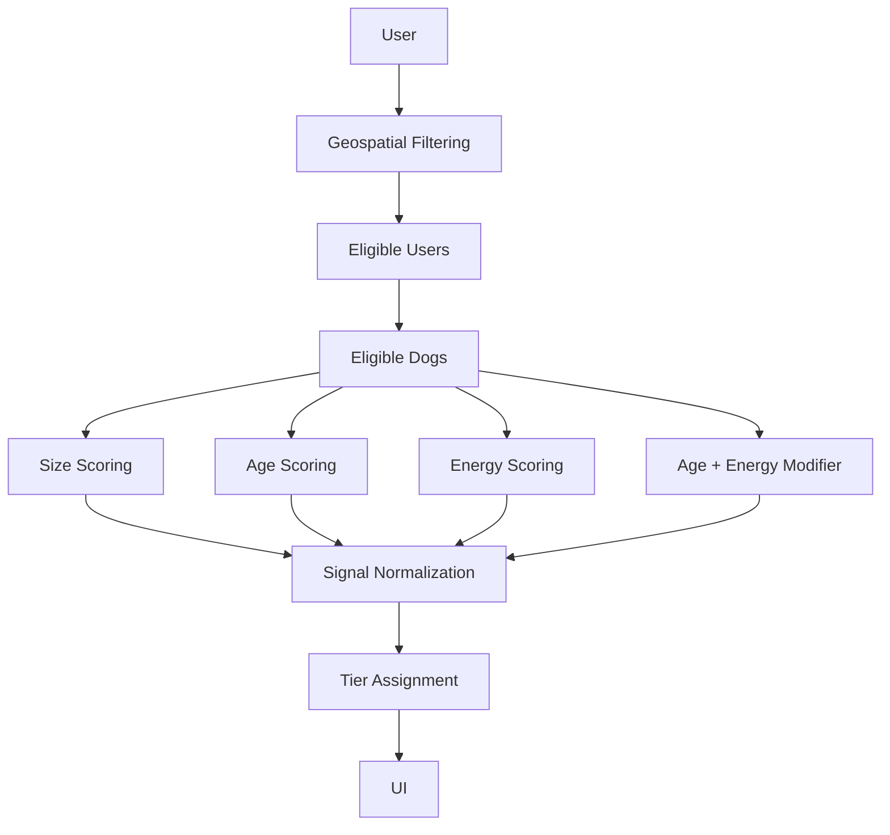

# Matching Pipeline

## Goal

Recommend compatible dogs while exposing the reasons behind the recommendation.

## Pipeline

1. Geospatial filtering
2. Eligibility checks
3. Compatibility scoring
4. Signal normalization
5. Tier assignment
6. UI presentation

## Why not a single score?

A single score is difficult to explain.

The system therefore separates:

- numerical compatibility
- caution signals
- hard warnings
- strengths

This allows the UI to explain both positive and negative aspects of a match.

## Flow Diagram

Compatibility scoring combines:

- Size compatibility
- Age compatibility
- Energy compatibility
- Age/Energy interaction modifiers